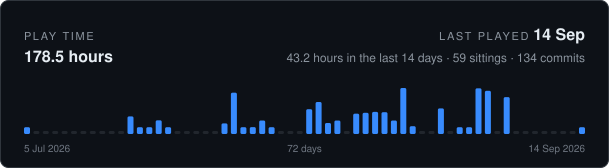

<!-- CODING-TIME:START -->



<details>
<summary>How this is counted</summary>

Commits record when work was saved, never how long it took, so this is an
estimate rather than a timesheet. Commits less than 120 minutes apart
count as one sitting and contribute the real time between them; a commit that
opens a sitting contributes a flat 120 minutes for the work that led up to
it. Merges are skipped, and nothing that was never committed is visible here.

Covers every author. Regenerated on each commit by `.githooks/coding-time`,
which reads commit timestamps and nothing else. `GAP_MINUTES`, `OPENING_MINUTES`,
`RECENT_DAYS` and `DAYS` change what it assumes.

</details>

<!-- CODING-TIME:END -->


Due to the amount of boilerplate required by the current framework,
adopting a pure Clean Architecture is not practical.
Instead, we follow its core dependency principle:
the Domain layer should remain independent and should not depend on Application, Infrastructure, or Presentation.

## Layers

Each service under `cloud/` is organised into four layers. Dependencies point
inward: Presentation and Infrastructure both depend on Application, Application depends on
Domain, and Domain depends on nothing. Presentation never calls Infrastructure directly —
they meet only through the ports Application declares.

### `application` — use cases, orchestration, transactions

Owns *what the system can do*. It coordinates domain objects and outbound ports, defines
the transaction boundary, and holds no business rules of its own: a rule that survives the
removal of the database and the HTTP layer belongs in Domain instead.

```
application
├── dto            Inputs and outputs of use cases, and the queries they accept.
├── command        Write requests, named imperatively (CreateCustomerCommand).
├── query          Read requests, separate from commands so the read and write models
│                  are free to diverge.
├── result         Use case return types, keeping callers off the domain model.
├── port
│   ├── in         Input ports — the interfaces Presentation calls. One per use case,
│   │              suffixed UseCase.
│   └── out        Output ports — the interfaces this layer needs someone to implement,
│                  suffixed Port. Declared here, implemented in Infrastructure, which is
│                  what inverts the dependency.
├── service        Implementations of the input ports. Transaction boundaries live here.
├── event          Integration events published outward, translated from domain events.
│                  These are a published contract: changing one breaks its consumers.
└── exception      Failures of use case execution — not found, forbidden, conflicting.
                   Business rule violations belong in Domain.
```

Use cases never call each other. Shared behaviour moves down into a domain service when it
is a business rule, or up into a coarser use case when it is a sequence of steps.

### `domain` — entities, value objects, business rules

The heart of the service, and the only layer with no outward dependencies. It must remain
meaningful with every framework stripped away.

```
domain
├── model          Entities and aggregate roots. Each guards its own invariants — an
│                  account refuses to go past its overdraft rather than trusting its
│                  callers to check.
├── valueobject    Immutable, identity-free types compared by value: Money, Email,
│                  AccountNumber. They carry behaviour, unlike DTOs.
├── constant       Enums naming the states and kinds the rules branch on: CustomerStatus,
│                  RiskSeverity. Domain vocabulary, so not in Presentation.
├── service        Business rules that span aggregates and therefore belong to no single
│                  entity. No persistence, no transactions, no I/O.
├── event          Facts expressed in domain language, recorded by aggregates and published
│                  by the layers above. Plain records with no messaging dependency; their
│                  main use is letting one aggregate react to another without sharing a
│                  transaction.
└── exception      Violations of business rules, such as an insufficient balance.
```

### `infra` — adapters to the outside world

Implements the output ports Application declares. Everything technology-specific lives
here, so swapping a technology touches this layer alone. The package is `infra`, not
`infrastructure`.

Each technology group splits the same way: `adapter` holds the class that implements a
port, and a sibling named after the technology holds what that class talks to. The port
implementation therefore never appears in the same package as the library it hides.

```
infra
├── persistence
│   ├── adapter    Storage adapters, suffixed PersistenceAdapter.
│   ├── jpa        Spring Data interfaces, prefixed Jpa (JpaCustomerRepository).
│   └── jooq       Generated-style table and record types for a service using jOOQ.
├── cache
│   ├── adapter    Cache adapters, kept apart from persistence so caching is a decision
│   │              the application layer never sees.
│   └── valkey     Key layouts and Valkey-specific types.
├── grpc
│   ├── server     Inbound gRPC services, suffixed GrpcService. An entry point that does
│   │              not sit in Presentation, because the generated base class it extends
│   │              belongs to the transport.
│   ├── client     Stub configuration for calling another service.
│   └── adapter    Where generated types and the domain model meet — the outbound port
│                  implementation, and the mapping either direction.
├── messaging      Publishers and consumers — the outbox relay, Kafka listeners.
├── external       Clients for other services and third-party APIs, suffixed by their
│                  transport (ExchangeRateHttpAdapter).
├── config         Spring configuration: data sources, serialisation, clients.
└── exception      Technical failures, translated into application or domain terms before
                   they cross the boundary.
```

### `presentation` — HTTP entry points

Maps requests onto use cases and use case results onto responses. It calls Application
only, and holds no business logic; a controller that decides something is a controller with
a rule in the wrong place.

```
presentation
├── controller     REST controllers, versioned by package (controller/v1).
├── dto            Request and Response records — the wire contract. Kept separate from the
│                  domain model so a schema change never leaks into the API, and so fields
│                  are exposed only when written here on purpose.
├── advice         @RestControllerAdvice handlers mapping exceptions onto status codes.
├── config         Web configuration: CORS, argument resolvers, converters.
└── filter         Servlet filters — request logging, correlation identifiers.
```

## Naming

One vocabulary per layer, so a name states where it belongs.

| Element                | Affix                  | Example                        |
|------------------------|------------------------|--------------------------------|
| Input port             | `UseCase`              | `CustomerUseCase`              |
| Output port            | `Port`                 | `CustomerPort`                 |
| Use case implementation| `Service`              | `CustomerService`              |
| Persistence adapter    | `PersistenceAdapter`   | `CustomerPersistenceAdapter`   |
| External adapter       | `<Transport>Adapter`   | `ExchangeRateHttpAdapter`      |
| Spring Data interface  | `Jpa` prefix           | `JpaCustomerRepository`        |
| Inbound gRPC service   | `GrpcService`          | `LedgerAccountGrpcService`     |
| gRPC stub configuration| `StubConfiguration`    | `LedgerAccountStubConfiguration` |
| Proto mapping          | `Protos`               | `LedgerAccountProtos`          |
| Wire contract          | `Request` / `Response` | `CustomerRequest`              |

`Impl` appears nowhere: an interface named `CustomerUseCase` and an implementation named
`CustomerService` already read differently.

## Scope

The tree above is the full vocabulary, not a checklist. Packages are created when there is
something to put in them — a service doing plain CRUD needs neither `command` nor `event`,
and adding them early costs files without buying structure. Layering earns its keep in
proportion to domain complexity.
